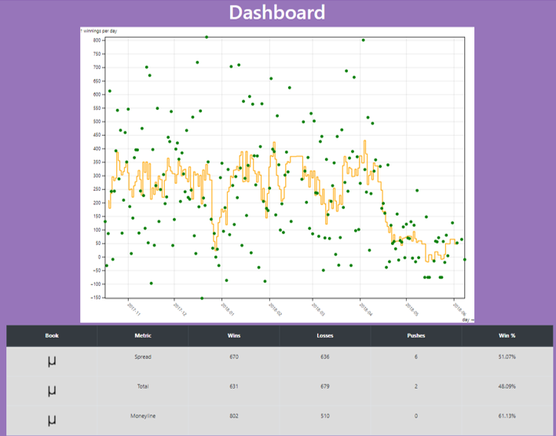
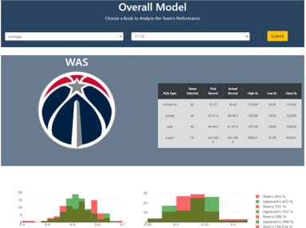
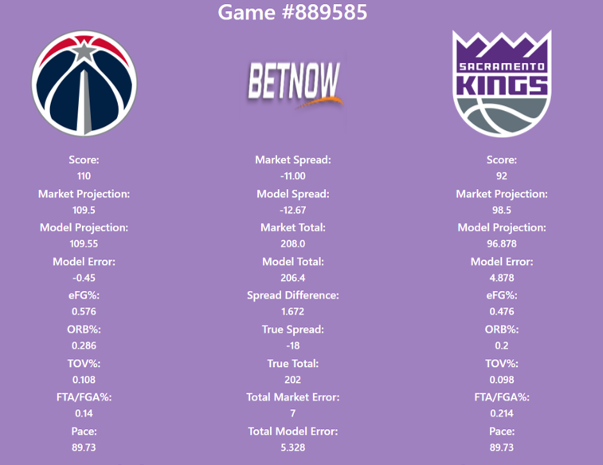
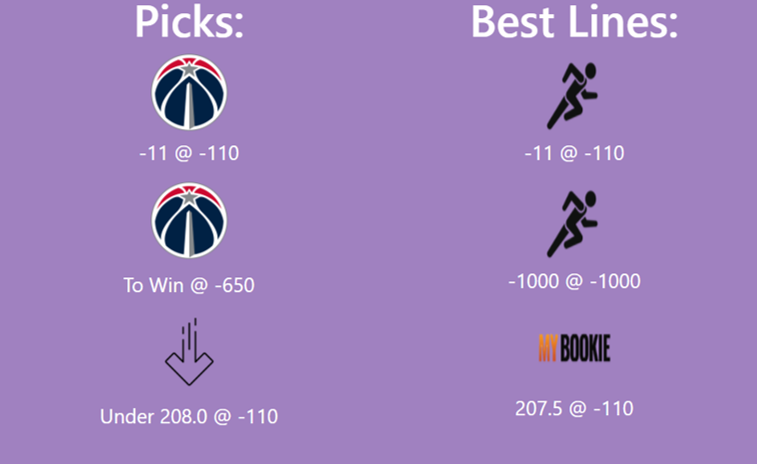
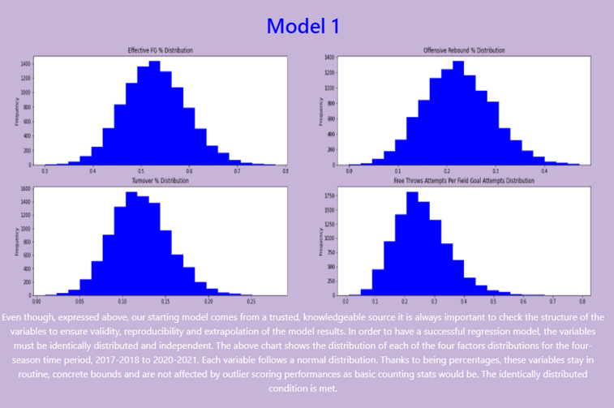

# Winning NBA Predictions
> A Gambling Model based on Advanced Team Statistics and Sportsbook Markets

## Description

> Data has changed the world of basketball. Enhanced player tracking technology and advanced computing has drastically changed the structure of professional basketball and the concepts of player value. It is a process in constant flux where edges are found and exploited until the entire league adjusts or legislates against them. With the reemergence of sports gambling in the United States, the value of understanding basketball through data analysis has never been higher. The goal of this project is to understand the activity of NBA sportsbook markets and create a machine learning model to predict scores and markets based on advanced team statistics.

> The data sources include all basic and advanced player statistics from the past four NBA seasons, 17-18 to 20-21, the closing numbers and associated odds for each game (total, moneyline and point spread markets) along with the timeseries data that inscribes changes to the odds or market number based on bettor activity.

## Getting Started 
[Application](https://nba-proj.herokuapp.com/overview)

</img>

> The starting dashboard breaks down the final model’s results based on the selected season and the selected sportsbook’s closing lines.

</img>

> The team dashboard displays the betting winnings and record for the team broken down by each market, the distribution of the model variables for the team and its opponents and the individual game projections, market projections and game results over the course of the selected season for the selected book.

</img>

</img>

> The game dashboard provides an enhanced look at an individual game with a wealth of data. It shows the score projections of the model and the selected market, the wagers placed given the market conditions, the best available markets, the game’s true model variables and scoring values and the associated errors of each prediction. It also provides the evolution of the total and spread markets by each available sportsbook over time.  The ending graphic displays the wager odds and total winnings based on the game’s projections.

</img>

> The analysis page provides a 10,000+ word guide through the entire lifecycle of the project from data collection to model selection and the debrief page entails a summary of all the lessons learned from this project.

### Toolset
* Languages: Python, JavaScript, HTML5, CSS3, SQL
* Frameworks: Flask, Bootstrap
* Data Collection: Selenium, Requests, BeautifulSoup4
* Data Storage and Querying: SQLAlchemy
* Data Cleaning: Pandas, NumPy, Regex
* Data Modeling: Sci-Kit Learn, SciPy
* Visualization: D3.js, Plotly.js, Observable.js, JQuery.js

### Authors
Kyle Lewis – kylel9815@gmail.com

### Version History
* 0.1.0
    * Application Release on Heroku

## References
[Possession Calculator](https://fansided.com/2015/12/21/nylon-calculus-101-possessions/#:~:text=How%20does%20stats.NBA.com,correctly%20factor%20in%20team%20rebounds)
[Player and Team Data](https://www.basketball-reference.com/)
[Offshore Sportsbook Data](https://www.oddsshark.com/nba/scores)

Project Organization
------------

    ├── LICENSE
    ├── Makefile           <- Makefile with commands like `make data` or `make train`
    ├── README.md          <- The top-level README for developers using this project.
    ├── data
    │   ├── external       <- Data from third party sources.
    │   ├── interim        <- Intermediate data that has been transformed.
    │   ├── processed      <- The final, canonical data sets for modeling.
    │   └── raw            <- The original, immutable data dump.
    │
    ├── docs               <- A default Sphinx project; see sphinx-doc.org for details
    │
    ├── models             <- Trained and serialized models, model predictions, or model summaries
    │
    ├── notebooks          <- Jupyter notebooks. Naming convention is a number (for ordering),
    │                         the creator's initials, and a short `-` delimited description, e.g.
    │                         `1.0-jqp-initial-data-exploration`.
    │
    ├── references         <- Data dictionaries, manuals, and all other explanatory materials.
    │
    ├── reports            <- Generated analysis as HTML, PDF, LaTeX, etc.
    │   └── figures        <- Generated graphics and figures to be used in reporting
    │
    ├── requirements.txt   <- The requirements file for reproducing the analysis environment, e.g.
    │                         generated with `pip freeze > requirements.txt`
    │
    ├── setup.py           <- makes project pip installable (pip install -e .) so src can be imported
    ├── src                <- Source code for use in this project.
    │   ├── __init__.py    <- Makes src a Python module
    │   │
    │   ├── data           <- Scripts to download or generate data
    │   │   └── make_dataset.py
    │   │
    │   ├── features       <- Scripts to turn raw data into features for modeling
    │   │   └── build_features.py
    │   │
    │   ├── models         <- Scripts to train models and then use trained models to make
    │   │   │                 predictions
    │   │   ├── predict_model.py
    │   │   └── train_model.py
    │   │
    │   └── visualization  <- Scripts to create exploratory and results oriented visualizations
    │       └── visualize.py
    │
    └── tox.ini            <- tox file with settings for running tox; see tox.readthedocs.io

--------

<small>Project based on the <a target="_blank" href="https://drivendata.github.io/cookiecutter-data-science/">cookiecutter data science project template</a>. #cookiecutterdatascience</small>

